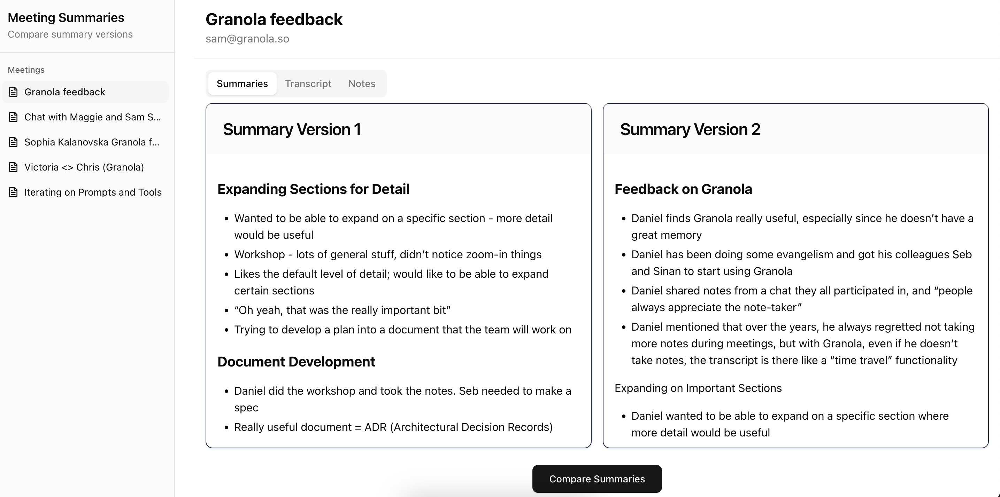

# Meeting Summary Tool

A modern web application for comparing and evaluating meeting summaries generated by different AI models or prompts. This tool helps teams analyze and determine which summary approach produces the most effective results based on criteria like truthfulness, clarity, conciseness, and relevance.



## Features

-   **Side-by-Side Summary Comparison**: View two versions of meeting summaries simultaneously
-   **AI-Powered Evaluation**: Use OpenAI's GPT-4o to analyze and compare summaries based on multiple criteria
-   **Meeting Navigation**: Easily browse between different meetings via a sidebar
-   **Context Access**: View meeting transcripts and notes for additional context
-   **Responsive Design**: Optimized for desktop viewing experience
-   **Animated UI**: Smooth transitions and animations for a polished user experience
-   **Comprehensive Testing**: Unit tests using Vitest and React Testing Library

## Technologies Used

-   **Next.js 14**: React framework with App Router
-   **React**: UI component library
-   **TypeScript**: Type-safe JavaScript
-   **Tailwind CSS**: Utility-first CSS framework
-   **ShadCN/UI**: UI component library
-   **Framer Motion**: Animation library
-   **OpenAI API**: For AI-powered summary evaluation
-   **React Markdown**: For rendering markdown content
-   **Vitest**: Testing framework

## Getting Started

### Prerequisites

-   Node.js 18.0.0 or later
-   pnpm, npm or yarn package manager
-   OpenAI API key (for evaluation functionality)

### Installation

1.  Clone the repository:

    ```bash
    git clone https://github.com/RavneetAnand/nextjs-compare-summary-versions
    cd meeting-summary-too
    ```

2.  Install dependencies:

    ```bash
    pnpm install
    ```

    or

        yarn install

3.  Set up your environment variables:

    -   Create a .env.local file in the root directory.
    -   Add your OpenAI API key:

        ```bash
        OPENAI_API_KEY=your-openai-api-key-here
        ```

4.  Start the development server:

    ```bash
    pnpm run dev
    ```

    or

        yarn dev

5.  Open http://localhost:3000 to view the app in your browser.

### Running Tests

To run the unit tests:

    pnpm run test

or

    yarn test

## App URL

🚀 Live Demo: https://compare-summaries.vercel.app/

## Future Improvements

-   🗃️ **Save & Compare Later**: Allow saving summary versions and evaluations for future reference.
-   🧩 **Pluggable AI Models**: Easily switch between different AI models (e.g., GPT-4o, Claude 3, Gemini) for evaluation.
-   🎨 **Custom Themes**: Styling has been kept very nominal for this small app but we can let users customize colors, fonts, and layouts to suit their preferences.
-   🔍 **Improved Test Coverage**: Test coverage is around 54% right now. Ideally should be more than 90%
-   🔒 **Authentication & Team Collaboration**: Invite team members to view, comment, and vote on summary evaluations.

## Authors

Ravneet Singh Anand - [RavneetAnand](https://github.com/RavneetAnand)
